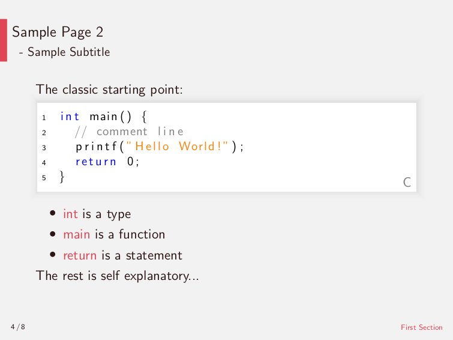

# Coding Lessons
> A collection of slides with lessons learned in programming.

Intended as a collection of insights gained during programming work this gathering of slides could evolve to a full presentation of many sub-sections. Being build by the document preparation system __LaTeX__, all slides editing is heavily content focused. The styling is derived from the template project at <https://github.com/rzllmr/latex-slides>.

Examples of the current look in a light and dark theme are displayed below:




## Build instructions

The TeX distribution recommended for all platforms is [MikTeX](https://github.com/MiKTeX/miktex), that provides an all-in-one solution to build the project. You just have to execute the following line in the working tree root directory:

```sh
texify --pdf --synctex=1 --clean ./presentation.tex
```

By targeting the initial _presentation.tex_ file, the whole project is compiled and stored as _presentation.pdf_.

## License

Licensed under the [MIT license](https://github.com/rzllmr/coding-lessons/blob/master/LICENSE).
