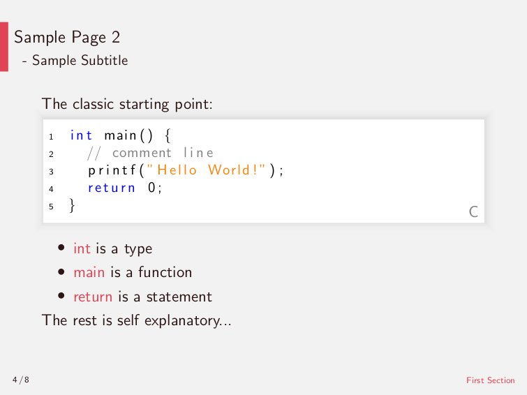
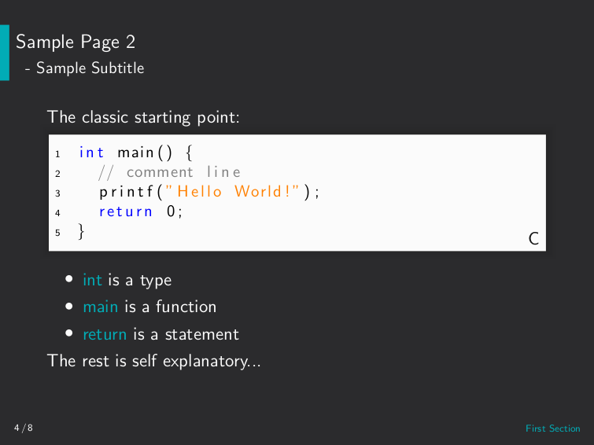

# LaTeX Presentation
> An evolving template for a content-oriented presentation.

To focus on the process of aggregating insights in slides all styling humps shall be cleared by a LaTeX template. This provides a custom theme for the beamer package and short commands dedicated to generate recurring elements. So that the main documents of the presentation are mostly comprised of the information alone.

Examples of the current default styling in a light and dark theme are displayed below:





Available styling themes are: __plain__

## Build instructions

The TeX distribution recommended for all platforms is [MikTeX](https://github.com/MiKTeX/miktex), that provides an all-in-one solution to build the project. You just have to execute the following line in the working tree root directory:

```sh
texify --pdf --synctex=1 --clean ./presentation.tex
```

By targeting the initial _presentation.tex_ file, the example project is compiled and stored as _presentation.pdf_.

## Usage instructions

1. Fork the template. (<https://github.com/rzllmr/latex-slides/fork>)
2. Choose the styling theme in _presentation.tex_. ([here](https://github.com/rzllmr/latex-slides/blob/master/presentation.tex#L4))
3. Replace the content of _slides/index.tex_ with your own. ([here](https://github.com/rzllmr/latex-slides/blob/master/slides/index.tex))\
Especially for larger quantities of slides it is recommended to separate the sections to different files and include them in _slides/index.tex_.

## License

Licensed under the [MIT license](https://github.com/rzllmr/latex-slides/blob/master/LICENSE).
